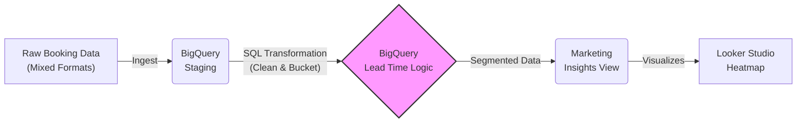

# Market Timing & Lead Time Analysis

This module focuses on **Marketing Spend Efficiency**. By analyzing the "Lead Time" (days between booking and arrival) per country, we determine exactly when to launch advertising campaigns for different regions.

## 🚀 Project Overview

The goal of this project is to solve a revenue optimization problem: **"When is the best time to spend marketing budget for each country?"**

By segmenting historical booking data into behavioral time windows (e.g., "Early Birds" vs. "Last Minute"), this tool provides actionable insights that allow the marketing team to align ad schedules with actual customer buying patterns, reducing wasted ad spend.

### Key Features:
- **Robust Data Cleaning:** Implements `COALESCE` logic to handle mixed date formats (Timestamps vs. Strings) without data loss.
- **Behavioral Segmentation:** Uses complex SQL `CASE` logic to bucket customers into 4 distinct marketing personas.
- **UX Optimization:** Formats output dates (e.g., "01. January") to enforce chronological sorting in visualization tools like Looker Studio.
- **Revenue Context:** Calculates average nightly rates per country to identify high-value target regions.

## Data Pipeline

## Business Logic & SQL Techniques

### 1. Data Cleaning (The `COALESCE` Strategy)
Real-world data often comes with inconsistent date formats (some as timestamps, some as text strings).
* **The Problem:** Standard date functions fail if the input format changes.
* **The Solution:** I implemented a robust `COALESCE` logic that attempts to cast the date as a Timestamp first; if that fails (returns NULL), it falls back to parsing it as a specific String format (`%m/%d/%Y`). This ensures 100% data coverage without errors.

### 2. Lead Time Bucketing (Segmentation)
Instead of a simple average, I segmented customers into actionable "Time Windows" using `CASE WHEN` logic:
* **Last Minute (0-14 Days):** Targets for "Flash Sales" and urgent inventory clearing.
* **Short Notice (15-28 Days):** Standard monthly campaigns.
* **Early Birds (42+ Days):** High-value targets for long-term brand awareness campaigns.

### 3. Visualization Optimization
* **Sorting Hack:** The query formats months as `'01. January', '02. February'` instead of just `'January'`. This forces the Visualization tool (Looker Studio) to sort months chronologically rather than alphabetically, fixing a common reporting UX issue.
